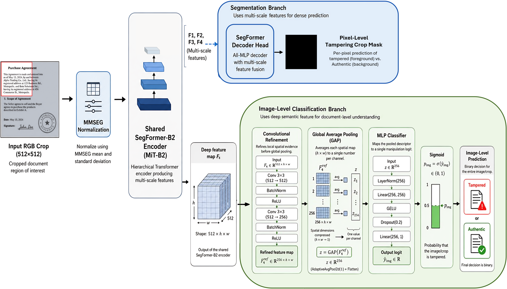

# Thesis: Document Forgery Detection

This repository contains the code developed for a master's thesis on **document forgery detection and localization**, with a particular focus on document-level manipulation detection in realistic document verification scenarios.

The work investigates deep learning approaches for detecting manipulated document images and localizing tampered regions. The main experimental pipeline is based on **SegFormer-B2**, including segmentation-only models, an MMSEG-based implementation, an image-level classification variant, and a final **dual-branch architecture** that combines pixel-level localization with document-level classification.

---

## Overview

The project explores the following main directions:

- Initial comparison between **HRNet**, **SegFormer-B2**, and **MiML** on DocTamper using RGB input;
- Evaluation of different input representations on the RTM dataset:
  - RGB;
  - Error Level Analysis (ELA);
  - High-pass filtering;
  - Edge-based information;
  - combinations of these representations;
- Comparison between Hugging Face and MMSEG implementations of SegFormer-B2;
- Image-level classification with an MMSEG-based SegFormer-B2 backbone;
- Dual-branch SegFormer-B2 models for joint segmentation and document-level classification;
- Image-only training of the dual-branch architecture to compare against the standalone MMSEG classification head and the full dual-branch model;
- Convolutional refinement in the image-level branch.

The final model uses a shared SegFormer-B2 encoder with two branches:

1. a segmentation branch for pixel-level manipulation localization;
2. an image-level branch for document-level tampering detection.

---

## Repository Structure

```text
thesis-document-forgery-detection/
│
├── datasets/
│   └── Dataset-related code and preprocessing utilities
│
├── models/
│   ├── HRNet-based models
│   ├── SegFormer-based models
│   ├── MIML-related models
│   ├── Dataset classes
│   ├── Training utilities
│   ├── Testing utilities
│   ├── Metrics
│   ├── Losses
│   └── Custom collate functions
│
├── scripts/
│   └── Training, testing and experiment scripts
│
├── inspection_pngs_doctamper_rtm/
│   └── Visual inspection outputs
│
├── test_doctamper_pep_outputs/
│   └── DocTamper test outputs for PEP-based exploratory experiments
│
├── test_doctamper_rgb_outputs/
│   └── DocTamper test outputs for RGB-based experiments
│
├── test_rtm_dual_branch_model_rgb_outputs/
│   └── RTM test outputs for dual-branch RGB models
│
├── test_rtm_dual_branch_model_with_conv_rgb_outputs/
│   └── RTM test outputs for dual-branch RGB models with convolutional fusion
│
├── test_rtm_mmseg_segformer_rgb_outputs/
│   └── RTM test outputs for SegFormer RGB models
│
├── test_rtm_mmseg_segformer_rgb_with_class_head_outputs/
│   └── RTM test outputs for SegFormer RGB models with classification head
│
├── test_rtm_several_inputs_outputs/
│   └── RTM test outputs for several input combinations
│
├── README.md
├── LICENSE
└── .gitignore
```

---

## Datasets

This project uses two main datasets.

### DocTamper

DocTamper is used for document tampering localization experiments.

Dataset link:

```text
https://www.kaggle.com/datasets/dinmkeljiame/doctamper
```

Expected structure:

```text
DocTamper/
├── DocTamperV1-FCD/
│   ├── tampered/
│   └── mask/
│
├── DocTamperV1-SCD/
│   ├── tampered/
│   └── mask/
│
└── DocTamperV1-TestingSet/
    ├── tampered/
    └── mask/
```

### Real Text Manipulation Dataset

The Real Text Manipulation dataset, referred to in this repository as **RTM**, is used for experiments involving real text manipulation cases.

Dataset link:

```text
https://drive.google.com/file/d/11AHZ8ih_kDCFilGceevppcGkKR4vDJD2/view
```

After downloading and extracting the dataset, update the dataset paths inside the training and testing scripts according to your local machine.

---

## Input Modalities

This repository contains code for several input representations used in document forgery localization experiments.

### RGB

RGB is the standard image representation and is used as a baseline input for document forgery localization.

It is used in both DocTamper and RTM experiments.

### ELA

ELA stands for **Error Level Analysis**.

It is a forensic image representation commonly used to highlight compression inconsistencies and possible manipulated regions. Since ELA is a known and established technique in image forensics, it is one of the main representations considered in the final experimental workflow.

### Auxiliary Channels

Some SegFormer experiments also include two auxiliary channels computed from the same input representation used by the model.

These auxiliary channels are:

- **High-pass channel**: highlights local high-frequency details and residual patterns.
- **Edge channel**: highlights contours, boundaries, and abrupt spatial transitions.

These channels provide complementary spatial information to the model. They are not independent forensic representations like ELA; instead, they are derived from the selected base input, such as RGB or ELA.

In this repository, variants marked with `2aux` use these two auxiliary channels together with the main input representation.

### Multiple Input Combinations

The RTM experiments evaluate several input configurations, including:

- RGB;
- RGB + 2aux;
- ELA;
- ELA + 2aux;
- RGB + ELA;
- RGB + ELA + 2aux.

### PEP

PEP stands for **Probabilistic Error Potential**.

PEP was implemented as an experimental input representation based on JPEG compression information. The repository contains dataset classes, collate functions, model runners, and training/testing scripts that support PEP inputs.

However, PEP was not selected as one of the main experimental directions in the final thesis workflow. The main reason is that PEP is a more exploratory representation in this context and has less direct literature support for the selected datasets and experimental setup. In contrast, ELA is a better-known forensic representation and is easier to justify with existing work.

Therefore, PEP-related code is kept in the repository for completeness and future experimentation, but the main experimental focus is on RGB, ELA, auxiliary channels, and their combinations.

---

## Models

### HRNet

HRNet-based models are included for document forgery localization experiments in the DocTamper dataset.

Implemented variants include:

- HRNet with RGB input
- HRNet with PEP input support

The PEP variant was implemented during the exploratory phase of the project, but the final focus moved away from PEP due to the lack of direct literature support for this representation in the selected experimental setting.

### SegFormer

SegFormer-based models are used for the main segmentation experiments, especially with the RTM dataset.

Implemented variants include:

- Hugging Face SegFormer-B2 with multiple input combinations;
- MMSEG-based SegFormer-B2 using RGB as input;
- MMSEG-based SegFormer-B2 with image-level classification head.

### MIML

HRNet-based models are included for document forgery localization experiments in the DocTamper dataset.

Implemented variants include:

- MIML with RGB input
- MIML with PEP input support

## Dual-Branch SegFormer-B2

The final architecture is a dual-branch MMSEG-based SegFormer-B2 model with convolutional refinement.

It contains:

- a shared MiT-B2 encoder;
- a segmentation branch for pixel-level localization;
- an image-level classification branch for document-level prediction.

Implemented variants include:

- dual-branch model without convolutional refinement;
- dual-branch model with convolutional refinement;
- image-only variant using only the image-level branch.

The final dual-branch architecture with convolutional refinement is illustrated below:



---

## How to Run

### HRNet, SegFormer-B2, and MiML on DocTamper using RGB as input

The first experimental stage compares the initial RGB-based architectures on DocTamper: **HRNet**, **SegFormer-B2**, and **MiML**.

The corresponding training scripts are:

- `hrnet_rgb_train.py`
- `segformer_b2_rgb_train.py`
- `miml_rgb_train.py`

They can be executed using the following general structure:

```bash
CUDA_VISIBLE_DEVICES=<gpu_ids> /path/to/python -m torch.distributed.run \
  --standalone \
  --nproc_per_node=<num_gpus> \
  -m models.<model_folder>.<train_script_without_py> \
  --epochs 100 \
  --batch_size <batch_size> \
  --accum_batch_size 128 \
  --save_root <path_to_save_weights> \
  --logger_path <path_to_log_file> \
  --tensorboard_path <path_to_tensorboard_folder>
```

The corresponding testing scripts are:

- `hrnet_rgb_test.py`
- `segformer_b2_rgb_test.py`
- `miml_rgb_test.py`

They can be executed using the following general structure:

```bash
CUDA_VISIBLE_DEVICES=<gpu_id> /path/to/python -m models.<model_folder>.<test_script_without_py>
```

### Hugging Face SegFormer-B2 on RTM with Several Input Representations

For the RTM experiments with several input combinations, the training scripts follow the same distributed execution logic. For example, the RGB + ELA configuration can be trained with:

The corresponding training scripts are:

- `train_segformer_b2_rgb_rtm.py`
- `train_segformer_b2_rgb_2aux_rtm.py`
- `train_segformer_b2_ela_rtm.py`
- `train_segformer_b2_ela_2aux_rtm.py`
- `train_segformer_b2_rgb_ela_rtm.py`
- `train_segformer_b2_rgb_ela_2aux_rtm.py`

```bash
CUDA_VISIBLE_DEVICES=<gpu_ids> /path/to/python -m torch.distributed.run \
  --standalone \
  --nproc_per_node=<num_gpus> \
  -m models.<model_folder>.<train_script_without_py> \
  --epochs 100 \
  --batch_size <batch_size> \
  --accum_batch_size 128
```

For testing, the notebook `scripts/RTM/rtm_mmseg_and_hf_segformer_b2_model_evaluation_rgb_and_several_inputs.ipynb` is used to evaluate the Hugging Face SegFormer-B2 model on several-input RTM configurations.

### MMSEG SegFormer-B2 on RTM using RGB as input

For the MMSEG-based SegFormer-B2 experiments on RTM, RGB is used as the main input representation. The training script follows the same distributed execution logic.

The corresponding training script is:

- `train_segformer_b2_mmseg_rgb_rtm.py`

```bash
CUDA_VISIBLE_DEVICES=<gpu_ids> /path/to/python -m torch.distributed.run \
  --standalone \
  --nproc_per_node=<num_gpus> \
  -m models.<model_folder>.<train_script_without_py> \
  --epochs 100 \
  --batch_size <batch_size> \
  --accum_batch_size 128
```

For testing, the notebook `scripts/RTM/rtm_mmseg_and_hf_segformer_b2_model_evaluation_rgb_and_several_inputs.ipynb` is used to evaluate the MMSEG SegFormer-B2 model using RGB as input.

### MMSEG SegFormer-B2 with Image-Level Classification Head

This experiment evaluates a standalone MMSEG-based SegFormer-B2 model with an image-level classification head. Unlike the segmentation model, this variant directly predicts whether an input crop contains manipulated content. This allows comparing the standalone MMSEG classification-head model against the image-level branch trained alone and the full dual-branch multi-task model (with and without convolutional refinement).

The corresponding training script is:

- `train_segformer_b2_mmseg_rgb_rtm_with_class_head.py`

```bash
CUDA_VISIBLE_DEVICES=<gpu_ids> /path/to/python -m torch.distributed.run \
  --standalone \
  --nproc_per_node=<num_gpus> \
  -m models.<model_folder>.<train_script_without_py> \
  --epochs 100 \
  --batch_size <batch_size> \
  --accum_batch_size 128
```

For testing, the notebook `scripts/RTM/rtm_mmseg_segformer_b2_model_evaluation_rgb_with_class_head.ipynb` is used to evaluate the MMSEG SegFormer-B2 model with image-level classification head on RTM.

### Dual-Branch MMSEG SegFormer-B2 on RTM

This experiment trains the proposed dual-branch MMSEG-based SegFormer-B2 model. The model combines a segmentation branch for pixel-level localization with an image-level branch for document-level manipulation detection.

The corresponding training script is:

- `train_dual_branch_segformer_b2_mmseg_rgb_rtm.py`

```bash
CUDA_VISIBLE_DEVICES=<gpu_ids> /path/to/python -m torch.distributed.run \
  --standalone \
  --nproc_per_node=<num_gpus> \
  -m models.<model_folder>.<train_script_without_py> \
  --epochs 100 \
  --batch_size <batch_size> \
  --accum_batch_size 128
```

For testing, the notebook `scripts/RTM/rtm_dual_branch_model_evaluation_rgb.ipynb` is used to evaluate the dual-branch model on RTM.

### Dual-Branch MMSEG SegFormer-B2 with Convolutional Refinement

This experiment trains the final dual-branch model with convolutional refinement in the image-level branch. The refinement block processes the deepest encoder feature map before global average pooling, improving document-level classification performance.

The corresponding training script is:

- `train_dual_branch_segformer_b2_mmseg_rgb_with_convs_rtm.py`

```bash
CUDA_VISIBLE_DEVICES=<gpu_ids> /path/to/python -m torch.distributed.run \
  --standalone \
  --nproc_per_node=<num_gpus> \
  -m models.<model_folder>.<train_script_without_py> \
  --epochs 100 \
  --batch_size <batch_size> \
  --accum_batch_size 128
```

For testing, the notebook `scripts/RTM/rtm_dual_branch_model_evaluation_rgb.ipynb` is also used to evaluate the dual-branch model with convolutional refinement on RTM.

### Image-Only Dual-Branch Variants

The image-only variants are used to train only the image-level branch, without multi-task supervision from the segmentation branch. This allows comparing the image-level branch trained alone (with and without convolutional refinement) against the standalone MMSEG classification-head model and the full dual-branch multi-task model (with and without convolutional refinement).

For the standard dual-branch model, the image-only setting is obtained from:

- `train_dual_branch_segformer_b2_mmseg_rgb_rtm.py`

To run this setting, apply the code changes indicated in the comments inside the training script.

For the convolutional refinement version, the image-only setting is already implemented in:

- `train_dual_branch_segformer_b2_mmseg_rgb_with_convs_rtm.py`

This variant corresponds to the dual-branch image-level branch with convolutional refinement trained only with the image-level objective.

To run, we do:

```bash
CUDA_VISIBLE_DEVICES=<gpu_ids> /path/to/python -m torch.distributed.run \
  --standalone \
  --nproc_per_node=<num_gpus> \
  -m models.<model_folder>.<train_script_without_py> \
  --epochs 100 \
  --batch_size <batch_size> \
  --accum_batch_size 128
```

### Important Notes

- Some paths in the scripts are machine-specific and must be changed before running the code;
- The commands below assume that training and testing are executed in a parallel/distributed setting using `torch.distributed.run`. Even when a single GPU is used, the scripts are launched through the same interface with `--nproc_per_node=1`.
